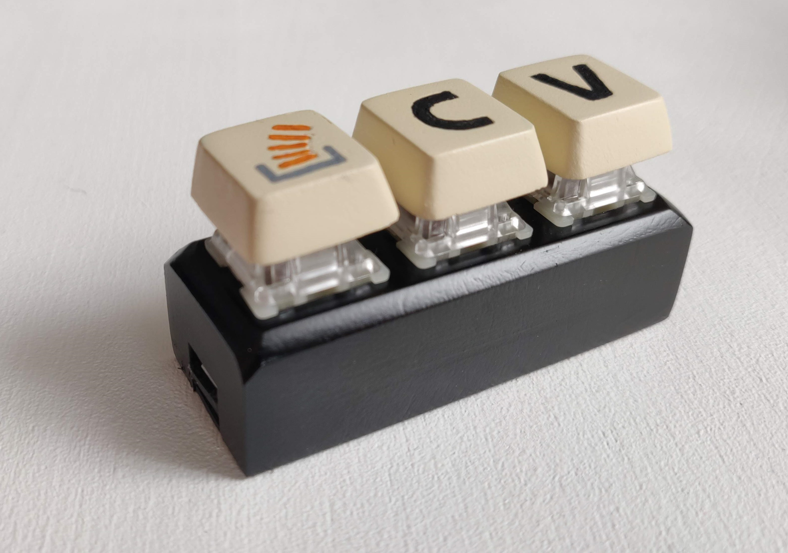

# The Key

3D Printing and Programming a 3-Key Macro Keyboard akin to [The Key™ by Stack Overflow](https://stackoverflow.blog/2021/03/31/the-key-copy-paste/).

## Prerequisites

You'll need a 3D Printer and a Soldering Iron as well as following materials:

* 3 Mechanical Cherry-MX-compatible Keyboard Switches
* 1 [Arduino Pro Micro](https://eckstein-shop.de/HIMALAYA-Basic-Pro-Micro-5V-16MHz-Arduino-Mini-Leonardo-Compatible-board)
* Solder and wire
* Optionally sand paper and paint for the finish

## Getting started

3D Print all components as provided. The case_top should be printed upside down with supports. I printed the key caps upright with supports to get the engraving right. I printed with PLA in 0.16mm quality with 20% infill for the case and 0.12mm quality with 20% infill for the key caps.

Insert the switches from the top and solder one wire of each switch to ground and the others to the Pins 2, 3 and 4 (can be changed in [the arduino sketch](keyboard.ino)). Connect the arduino to your PC via the micro USB port and flash [the sketch](keyboard.ino) with the [Arduino IDE](https://www.arduino.cc/en/software). Make sure you have the correct board and CPU set up and chosen as described in the
[Sparkfun Pro Micro Setup guide](https://learn.sparkfun.com/tutorials/pro-micro--fio-v3-hookup-guide#windows_boardaddon).

For more details you can follow [this Blog Post by Dave Madison](https://www.partsnotincluded.com/diy-stream-deck-mini-macro-keyboard/).

## Customizing

To adjust the case you can edit the included [case.scad file](case.scad) with [OpenSCAD](https://www.openscad.org/).

You can use different pins on your arduino and change the key signals by editing the Key definitions and Pin definitions in the beginning of [keyboard.ino](keyboard.ino).

## License and Attribution

This project excluding the key cap models is licensed under the terms of the MIT license. The logo is licensed under the terms of the [CC BY-SA 3.0 license](https://creativecommons.org/licenses/by-sa/3.0/).

They Key Cap models are base on [Toblerone2000's Blank Key Cap](https://www.thingiverse.com/thing:3906256).

The arduino code is modified from [Dave Madison's DIY Stream Deck article](https://www.partsnotincluded.com/diy-stream-deck-mini-macro-keyboard/).
